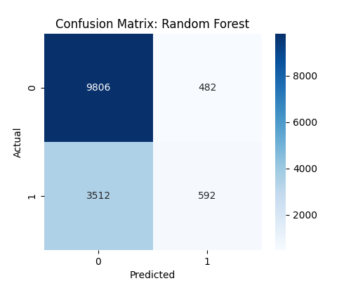
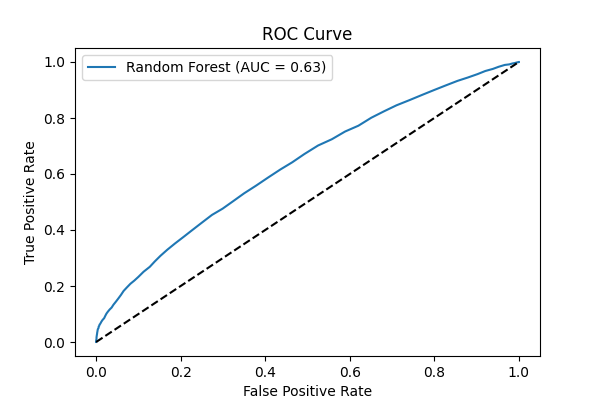

# Medical Appointment No-Show Prediction

## 📘 Project Overview

This project aims to predict whether a patient will **miss their scheduled medical appointment** using a classification model. The goal is to support healthcare providers in identifying patients at risk of no-shows, optimizing schedules, reducing missed appointments, and improving healthcare efficiency.

---

## 📂 Dataset Description

**Dataset Name**: Medical Appointment No-Show Dataset  
**Source**: Kaggle / Brazilian public hospitals  
**Format**: CSV  
**Size**: < 100MB  

### 🔑 Key Columns:

| Column          | Description |
|-----------------|-------------|
| `PatientId`     | Unique identifier for patient |
| `AppointmentID` | Unique identifier for appointment |
| `Gender`        | Male or Female |
| `ScheduledDay`  | Date the appointment was scheduled |
| `AppointmentDay`| Date of the actual appointment |
| `Age`           | Patient’s age |
| `Neighbourhood` | Location of hospital |
| `Scholarship`   | 1 if enrolled in welfare program |
| `Hipertension`  | 1 if patient has hypertension |
| `Diabetes`      | 1 if patient has diabetes |
| `Alcoholism`    | 1 if patient has alcoholism history |
| `Handcap`       | Disability level (0–4) |
| `SMS_received`  | 1 if patient received SMS reminder |
| `No-show`       | **Target variable**: ‘Yes’ or ‘No’ |

---

## 🧹 Data Cleaning & Preprocessing

1. Converted date columns (`ScheduledDay`, `AppointmentDay`) into datetime.
2. Removed unnecessary columns like `PatientId`, `AppointmentID`.
3. Encoded categorical variables like `Gender`, `Neighbourhood`, and `No-show`.
4. Handled missing and duplicate data.
5. Standardized numeric features like `Age` using `StandardScaler`.

---

## 🤖 Machine Learning Models Used

We trained and evaluated the following classification models:

- **Logistic Regression**
- **Random Forest Classifier**
- **XGBoost Classifier**
- **CatBoost Classifier**
- **LightGBM Classifier**
- **MLP Classifier (Neural Network)**
- **Stacking Ensemble**

Each model was trained on 80% of the dataset and tested on the remaining 20%.

---

## 📊 Model Evaluation Metrics

The models were evaluated using:

- **Accuracy**
- **Precision**
- **Recall**
- **F1 Score**
- **ROC AUC Score**

### ✅ Final Evaluation Table (without SMOTE):

| Model             | Accuracy | Precision | Recall  | F1 Score | ROC AUC |
|------------------|----------|-----------|---------|----------|---------|
| Random Forest     | 0.7225   | 0.5512    | 0.1442  | 0.2287   | 0.6330  |
| CatBoost          | 0.7192   | 0.5675    | 0.0646  | 0.1159   | 0.6233  |
| LightGBM          | 0.7186   | 0.6125    | 0.0358  | 0.0677   | 0.6169  |
| XGBoost           | 0.7164   | 0.5155    | 0.0931  | 0.1577   | 0.6154  |
| Logistic Regression| 0.7142  | 0.4211    | 0.0058  | 0.0115   | 0.5881  |
| MLP Classifier    | 0.6954   | 0.4114    | 0.1584  | 0.2287   | 0.5875  |
| Stacking Ensemble | 0.7148   | 0.0000    | 0.0000  | 0.0000   | 0.5329  |

---

## 📈 Visual Outputs

### Confusion Matrix for Best Model (Random Forest)


### ROC Curve for Best Model (Random Forest)


---

## 💾 Saved Artifacts

| File | Description |
|------|-------------|
| `output/best_model.pkl` | Serialized best model using `joblib` |
| `output/scaler.pkl`     | Scaler used for standardizing inputs |
| `output/confusion_matrix.png` | Confusion matrix plot |
| `output/roc_curve.png`  | ROC AUC curve plot |

---

## 🚀 How to Use

```bash
# Step 1: Install dependencies
pip install -r requirements.txt

# Step 2: Load the model and scaler
import joblib
model = joblib.load('output/best_model.pkl')
scaler = joblib.load('output/scaler.pkl')

# Step 3: Predict on new data
X_new_scaled = scaler.transform(new_data)
y_pred = model.predict(X_new_scaled)
```

---

## 🙋 Contact

For project inquiries or contributions, feel free to reach out.

